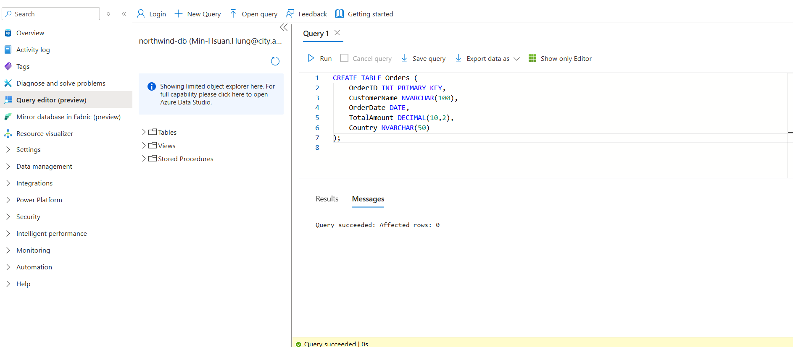
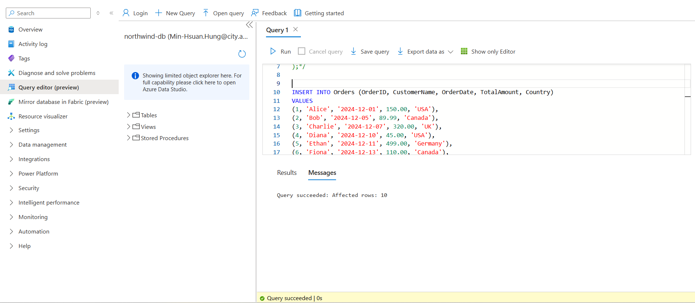
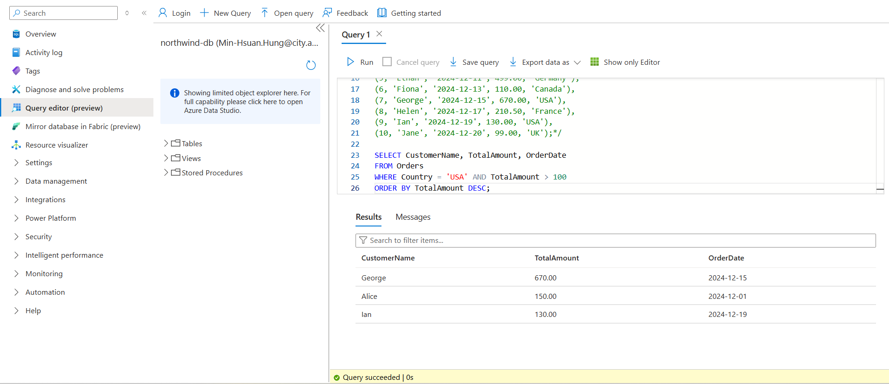

## Query Objective
Retrieve high-value orders placed by customers from the United States (USA), sorted by total amount in descending order.

## SQL Used
```sql
SELECT CustomerName, TotalAmount, OrderDate
FROM Orders
WHERE Country = 'USA' AND TotalAmount > 100
ORDER BY TotalAmount DESC;




